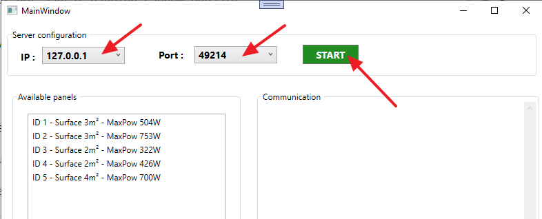

# SOLAR PANELS SERVER SIDE

### CLONE DIT PROJECT NAAR JE LOKALE COMPUTER
### JE HOEFT AAN DEZE CODE NIETS TE WIJZIGEN
### JE START DE APPLICATIE EN JE START DE SERVER (noteer IP en poort).
### JOUW CLIENT APP DIENT ALLEEN MAAR DE CORRECTE INSTRUCTIES NAAR DEZE APP TE STUREN EN INDIEN JE VRAGEN CORRECT ZIJN ZAL DE SERVER REAGEREN

  

**Achtergrond info over deze (server) app ... **

De server app maakt bij opstart een collectie van zonnepanelen aan :  
  * Het aantal panelen is random (van 3 tot 10 panelen)   
  * De grootte van de panelen is random (2, 3 of 4 m²)  
  * Het vermogen van een paneel wordt random bepaalt (tussen de 150 en 300W per m³)  
Verder valt er als gebruiker met deze app niets te doen.
Deze app zal via sockets reageren op verzoeken van eventuele clients (jouw werk dus).
De server begrijpt 3 instructies : 

    * **CONNECT##EOM**  
      Wanneer de server deze instructie ontvangt zal hij een string aanmaken die bestaat uit de ID's van de verschillende panelen, gescheiden door het | symbool.  
      Deze tekst wordt dan teruggestuurd naar de client.
      De server voegt GEEN extentie (##EOM) toe aan de tekst.
      De server toont de verstuurde tekst in zijn venster 
      
      
      
      

